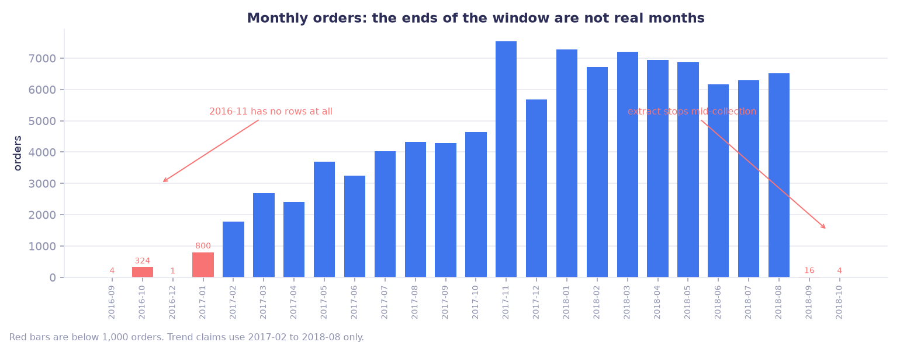
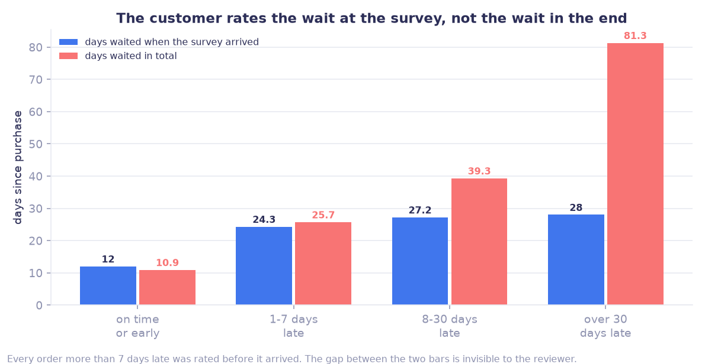

# Brazilian E-Commerce Analytics Platform (Olist)

End to end, from nine raw CSVs to a recommendation: ingest, a star schema,
automated quality checks, frozen metric definitions, and an analysis that says
what the numbers mean and where they cannot be trusted.

Built with **Python and SQL (DuckDB)** on the
[Brazilian E-Commerce Public Dataset by Olist](https://www.kaggle.com/datasets/olistbr/brazilian-ecommerce):
99,441 orders, 112,650 order items, 96,096 customers, 2016 to 2018.

Findings and charts: **[`docs/insights.md`](docs/insights.md)**.
What is and is not committed here: [`docs/repository_contents.md`](docs/repository_contents.md).

## Three findings

**The usable window is narrower than the date range.** Orders run from 2016-09
to 2018-10, but 2016-11 has no rows at all and the extract stops mid-September
2018. Plotting monthly orders without checking shows a 99.8% collapse that never
happened. Trend claims use 2017-02 to 2018-08 only.



**The customer key decides the answer.** The source carries two customer
identifiers: one changes on every order, the other identifies the person. 2,997
people hold more than one of the per-order ids and one holds seventeen. Keyed on
the order, repeat rate reads near zero. Keyed on the person, it is 3.0%.

**Missing a promised delivery date costs 1.6 review points**, and the chart that
shows it was binned on the wrong variable. Orders one to seven days late average
2.72 against 4.29 for on-time. But the review survey goes out about two days
after the promised date whether or not the package arrived, so every order more
than a week late was rated before it turned up. The difference between fifteen
days late and eighty-one days late happens after the review is written, and the
customer never sees it.



## Architecture

```
data/*.csv  →  ingest      →  lake/raw/olist        (+ s3://…/raw/olist)
            →  transform   →  DuckDB star schema
            →  quality     →  dq_report.json
            →  metrics     →  output/kpi_*.png      (definitions frozen in docs/metrics.md)
            →  insights    →  output/insights.json + output/fig_*.png
```

Star tables: `fact_orders`, `fact_order_items`, `dim_customers`, `dim_products`, `dim_sellers`, `dim_date`.
Two fact tables because the grain differs: one row per order, one row per order line.

First-pass exploration of the raw tables: [`explore_raw_data.ipynb`](explore_raw_data.ipynb).

## Quick start

```bash
python3 -m venv .venv
source .venv/bin/activate          # Windows: .venv\Scripts\activate
pip install -r requirements.txt

# Local lake only (no AWS required)
python -m src.run_pipeline --skip-s3

# Optional: DuckDB / DBCode preview (no path quoting issues)
python -m src.create_duckdb_workspace
# Then open lake/olist_workspace.duckdb in the extension and run sql/preview_star.sql

# KPI charts from processed star (same definitions as docs/metrics.md)
python -m src.report_kpis

# Insight layer: coverage, integrity, customer identity, delivery vs reviews
python -m src.run_insights
python -m src.plot_insights
```

Outputs:

- `lake/raw/olist/*.csv`
- `lake/processed/star/*.{parquet,csv}`
- `lake/processed/star/pipeline_metadata.json`
- `lake/processed/star/dq_report.json`
- `output/kpi_summary.json` + `output/kpi_*.png` (executive visuals)
- `output/insights.json` + `output/fig_*.png` + [`docs/insights.md`](docs/insights.md) (findings, charts, open questions)

## Also in the write-up

Beyond the three above, [`docs/insights.md`](docs/insights.md) covers the state
level picture (RJ is late like a far state while delivering like a near one),
concentration (3% of sellers carry 45% of GMV), why the headline order value
should be a median rather than a mean, and the questions this extract cannot
answer.

## Project status

| Area | Status |
|------|--------|
| Multi-stage ETL (ingest → star → DQ) | Done |
| Star schema SQL + local processed tables | Done |
| Docs (schema contract, metrics, columns, AWS) | Done |
| S3 upload support (`boto3`, `.env`) | Done (needs your bucket in `.env`) |
| Python KPI report (`report_kpis`) | Done — portfolio charts without Power BI Desktop |
| Insight layer (`run_insights`, `plot_insights`) | Done — [docs/insights.md](docs/insights.md) |
| Power BI Desktop dashboard | Optional follow-up — connect `lake/processed/star/` per [docs/power_bi.md](docs/power_bi.md) |

## AWS S3 run

1. Follow [`docs/aws_setup.md`](docs/aws_setup.md) (bucket + IAM + `aws configure`).
2. `cp .env.example .env` and set `S3_BUCKET`, `AWS_REGION` (optional `AWS_PROFILE`).
3. Run:

```bash
python -m src.run_pipeline
```

Or stages individually:

```bash
python -m src.ingest_raw
python -m src.transform_star
python -m src.dq_checks
```

## Repository layout

| Path | Role |
|------|------|
| `data/` | Source Olist CSVs (Kaggle) |
| `src/` | ETL + `report_kpis.py` (KPI charts) + `run_insights.py` (insight layer) |
| `output/` | KPI JSON + PNG charts |
| `sql/star_schema.sql` | Star schema DDL/DML for DuckDB |
| `lake/` | Local raw + processed mirrors (gitignored data files) |
| `docs/` | AWS setup, schema contract, metrics, column metadata, Power BI, insights |
| `.env.example` | Env template |

## Documentation

| Doc | Purpose |
|-----|---------|
| [docs/aws_setup.md](docs/aws_setup.md) | Bucket, IAM, credentials |
| [docs/schema_contract.md](docs/schema_contract.md) | Grain, keys, relationships |
| [docs/metrics.md](docs/metrics.md) | KPI definitions |
| [docs/insights.md](docs/insights.md) | Findings, caveats and open questions |
| [docs/column_metadata.md](docs/column_metadata.md) | Column-level dictionary |
| [docs/power_bi.md](docs/power_bi.md) | Connect model + report pages + sample DAX |

## Resume checklist (artifacts)

| Resume claim | Artifact |
|--------------|----------|
| Multi-stage ETL + S3 lake | `src/ingest_raw.py`, `src/transform_star.py`, `docs/aws_setup.md` |
| Star schema | `sql/star_schema.sql`, `docs/schema_contract.md` |
| Automated DQ | `src/dq_checks.py`, `dq_report.json` |
| Schema/metric documentation | `docs/schema_contract.md`, `docs/metrics.md`, `docs/column_metadata.md` |
| Analytics-ready reporting | `src/report_kpis.py` + `output/kpi_*.png`; optional Power BI via `docs/power_bi.md` |

## Data source

Olist. *Brazilian E-Commerce Public Dataset by Olist* [Data set]. Kaggle.  
https://www.kaggle.com/datasets/olistbr/brazilian-ecommerce
