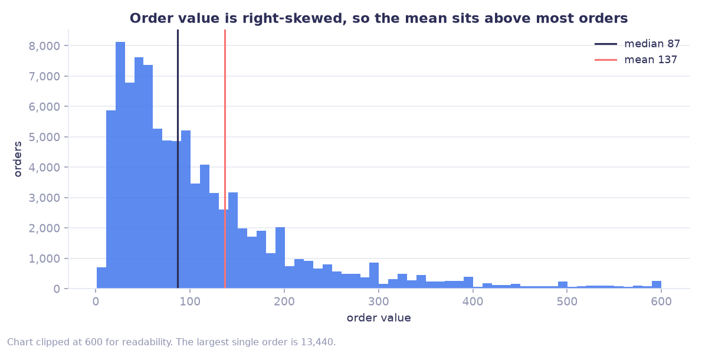
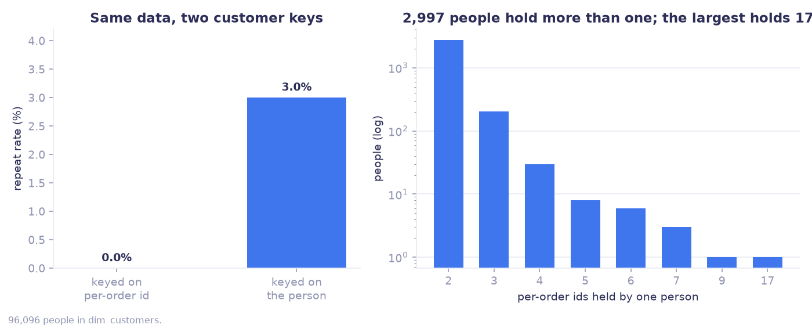
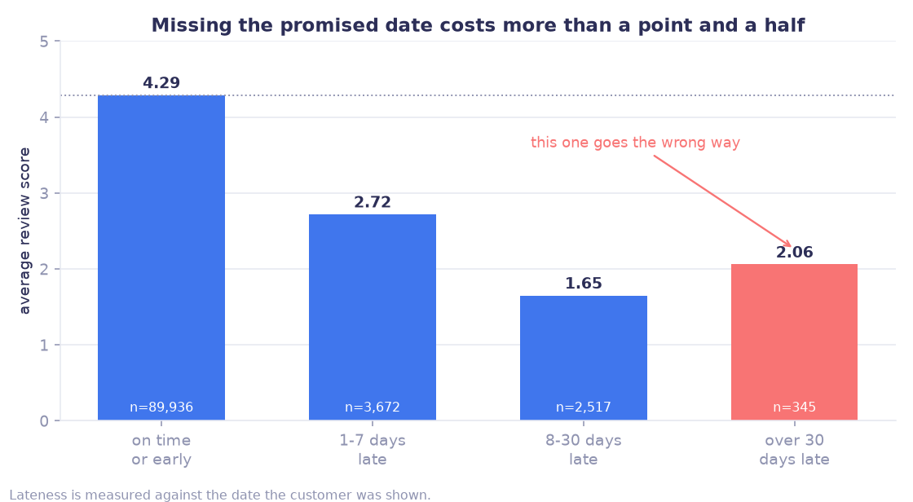
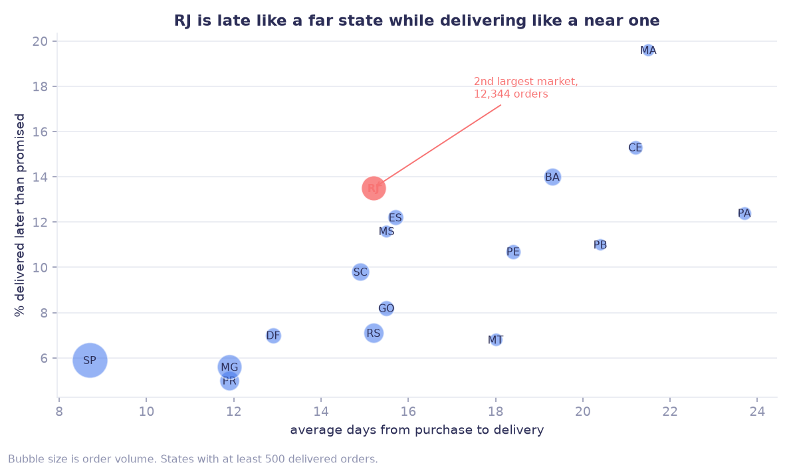

# Insights

Stage 4 of the pipeline. Everything below is regenerated by:

```bash
python -m src.run_insights   # numbers  -> output/insights.json
python -m src.plot_insights  # charts   -> output/fig_*.png
```

It reads `lake/processed/star/` and writes `output/insights.json`. It never
writes back into the lake. Every number in this document comes from that file,
so it can be re-checked rather than taken on trust.

All figures filter to `order_status = 'delivered'` unless stated otherwise,
which is the same default recorded in [`metrics.md`](metrics.md).

---

## 1. What the data can and cannot answer

This section comes before any finding, because two of the checks below change
which questions are askable at all.

### 1.1 The window is not what the min and max dates suggest

Orders run from **2016-09-04** to **2018-10-17**. Reporting that as a 25-month
window would be wrong.

| Month | Orders |
| --- | ---: |
| 2016-09 | 4 |
| 2016-10 | 324 |
| **2016-11** | **absent from the data entirely** |
| 2016-12 | 1 |
| 2017-01 | 800 |
| … | ~6,000 to 7,500 per month |
| 2018-08 | 6,512 |
| 2018-09 | 16 |
| 2018-10 | 4 |

Two separate problems:

- **A missing month.** 2016-11 has no rows at all. Not zero orders reported: no
  rows. The early period behaves like a pilot rather than normal operation.
- **A cut-off tail.** August has 6,512 orders, September has 16. The business
  did not collapse. The extract stops mid-collection.


Anyone who plots monthly orders without checking this reports a 99.8% drop in
September and starts investigating a problem that does not exist.

**Reliable window for any trend or seasonality claim: 2017-02 to 2018-08**, 19
months. The months outside it are kept in the data, not deleted, and excluded
at query time when the question is about trend.

### 1.2 Status and timestamps disagree on a small number of rows

| Check | Rows |
| --- | ---: |
| `delivered` with no delivery date | 8 |
| `canceled` with a delivery date | 6 |
| Orders with no review at all | 768 |

Fourteen contradictory rows out of 99,441 changes no aggregate. They are worth
recording anyway, because they say something about the source: the status field
and the timestamp fields are not written by the same process, so one can move
without the other. That matters more for a live pipeline than for this extract.

### 1.3 Mean order value is not a useful headline

| | Value |
| --- | ---: |
| Mean order GMV | 137.04 |
| Median order GMV | 86.57 |
| Largest single order | 13,440.00 |

Mean is 1.58x the median. Any per-order figure reported as an average should be
a median, or be paired with one.



---

## 2. The customer key decides the answer

The source gives two customer identifiers:

- `customer_id` changes on every order. It identifies an order's customer record.
- `customer_unique_id` identifies the person.

`sql/star_schema.sql` keys `dim_customers` on `customer_unique_id`. That choice
is the difference between a real answer and a meaningless one.

| | Value |
| --- | ---: |
| People | 96,096 |
| People holding more than one `customer_id` | 2,997 |
| Most `customer_id` values held by one person | 17 |

Keyed on `customer_id`, those 2,997 people become roughly 6,000 separate
customers, the person with 17 orders becomes 17 one-time buyers, and repeat rate
collapses to near zero. The reported conclusion would be "nobody ever comes
back", which is false.

Keyed on the person, **repeat rate is 3.0%**.



### 2.1 Repeat buyers are worth more in total and less per order

| Segment | Customers | Avg lifetime GMV | Avg per order |
| --- | ---: | ---: | ---: |
| Repeat | 2,801 | 260.05 | 122.96 |
| One time | 90,557 | 137.96 | 137.96 |

A repeat customer is worth 1.9x over their lifetime, but spends about 11% less
on each individual order. Averaging over orders and averaging over people give
opposite impressions of the same customers.

3.0% is still low for retail. This reads as a genuine characteristic of the
marketplace rather than a data artifact, since the key question above is already
settled.

---

## 3. Lateness is the strongest lever on satisfaction

Nationally: **12.5 days** from purchase to delivery, **8.1%** delivered later
than the estimate given to the customer.

| Delivery outcome | Orders | Avg review | 1 or 2 star |
| --- | ---: | ---: | ---: |
| On time or early | 89,936 | 4.29 | 9.2% |
| 1 to 7 days late | 3,672 | 2.72 | 49.4% |
| 8 to 30 days late | 2,517 | 1.65 | 80.7% |
| Over 30 days late | 345 | 2.06 | 67.8% |

Missing an estimate by a single week moves the average review from 4.29 to 2.72
and multiplies one and two star reviews more than fivefold. Lateness is measured
against the estimate shown to the customer, not against an internal target, so
this is about a broken promise rather than absolute speed.

### 3.1 One bar goes the wrong way, and it is the chart's fault



Orders more than 30 days late score **better** than orders 8 to 30 days late
(2.06 against 1.65). Everywhere else the relationship is monotonic.

Three explanations were tested and rejected:

- **Missing reviews.** Only 16 of 345 lack a review, in line with other buckets.
- **An unrealistic promise.** The promised window is 25.9 days for this bucket,
  slightly *longer* than the 24.7 days for the 8-to-30 bucket. Not it.
- **Composition.** RJ is 39.6% of this bucket against 29.2% of the other, but RJ
  reviews below average, which would push the score down rather than up.

The answer came from the review timestamp, which lives in the raw reviews file
rather than the star schema.


| Bucket | Survey sent, vs promised date | Days waited when rated | Final lateness | Rated before delivery | Score |
| --- | ---: | ---: | ---: | ---: | ---: |
| On time or early | 12.4 days **before** | 12.0 | -13.5 | 0.4% | 4.29 |
| 1 to 7 days late | 2.3 days after | 24.3 | 3.6 | 54.8% | 2.71 |
| 8 to 30 days late | 2.4 days after | 27.2 | 14.6 | **100%** | 1.65 |
| Over 30 days late | 2.2 days after | 28.0 | 55.4 | **100%** | 2.05 |

**The survey goes out about two days after the promised date, whether or not the
package has arrived.** On-time orders get it at delivery, which is early because
they arrive in 10.9 days against 24.5 promised. Late orders get it anyway.

So every order more than seven days late was rated before the customer received
anything. And at the moment of rating, the two late buckets had waited almost the
same time: 27.2 days and 28.0 days.

The difference between arriving 15 days late and 81 days late happens *after the
review is written*. The customer never sees it.

**The bucket variable is something the reviewer did not know.** Binning review
scores by final lateness asks the data a question the customer was never in a
position to answer. That is a flaw in the chart, not a fact about customers.

A residual gap of 0.4 points remains after this, on 331 orders. Composition and
shipping status at survey time do not account for it. Still open.

### 3.2 Distance drives lateness, lateness drives reviews, freight follows



| State | Orders | Days to deliver | Late | Avg review | Freight as % of GMV |
| --- | ---: | ---: | ---: | ---: | ---: |
| SP | 40,498 | 8.7 | 5.9% | 4.25 | 13.9% |
| MG | 11,354 | 11.9 | 5.6% | 4.19 | 17.2% |
| PR | 4,923 | 11.9 | 5.0% | 4.24 | 17.4% |
| RJ | 12,344 | 15.2 | 13.5% | 3.97 | 16.8% |
| BA | 3,256 | 19.3 | 14.0% | 3.93 | 19.8% |
| CE | 1,277 | 21.2 | 15.3% | 3.94 | 21.3% |
| MA | 720 | 21.5 | 19.6% | 3.84 | 26.4% |
| PA | 946 | 23.7 | 12.4% | 3.91 | 21.5% |

The far states pay twice: delivery takes two to three times as long, and freight
eats 21 to 26% of order value against 14% in São Paulo.

**RJ is the one to act on.** It is the second largest market at 12,344 orders,
yet it is late 13.5% of the time, more than double SP and MG, on a delivery time
of 15.2 days. Unlike the northern states, the volume is there to justify fixing
it, and 15 days is not a distance problem the way 24 days in PA is.

### 3.3 What this implies

The lever is not "ship faster everywhere". It is the gap between the promise and
the delivery.

1. Widen the estimated delivery date in states where the late rate is high. This
   costs conversion but is testable, and a 4.29 review is worth more than a day
   of quoted speed.
2. Investigate RJ specifically, since its late rate does not match its distance.
3. Treat freight share as a margin question in the north, separate from the
   satisfaction question.

Each of these is a proposal with a measurable outcome, not a conclusion.

---

## 4. Concentration

| | Value |
| --- | ---: |
| Top 10 categories | 62.4% of GMV |
| Largest single category (health & beauty) | 9.3% |
| Sellers | 3,095 |
| Top 100 sellers | 45.1% of GMV |
| Top 10 sellers | 13.1% of GMV |
| SP share of orders | 42.0% |
| Top 3 states | 66.5% |

Category revenue is spread: no category reaches 10%. Sellers and geography are
not: 3% of sellers carry 45% of GMV, and two in five orders ship to one state.

Payment is concentrated too: credit card covers 72,122 of the delivered orders
against 19,191 on boleto, with average values of 165.86 and 144.33.

---

## 5. Open questions

Kept visible rather than resolved, because each needs data this extract does not
contain.

- The over-30-days-late review anomaly in 3.1, survivorship first.
- Whether undelivered orders exist outside the extract. `canceled` and
  `unavailable` together are 1.2%, which seems low for a marketplace.
- The 768 orders with no review: silent satisfaction or silent churn.
- Repeat rate of 3.0% has no benchmark here. It needs either a comparable
  marketplace or a cohort view over a longer window.

---

## 6. Where each finding is used

| Question | Section |
| --- | --- |
| How do you approach a dataset you have not seen before | 1 |
| Tell me about a time the data was dirty | 1.1, 1.2 |
| How do you know a number can be trusted | 2 |
| A metric looks wrong, what do you do | 2, 3.1 |
| Give me an insight and a recommendation | 3.2, 3.3 |
| What did you not figure out | 3.1, 5 |
| Tell me about a chart that misled you | 3.1 |
